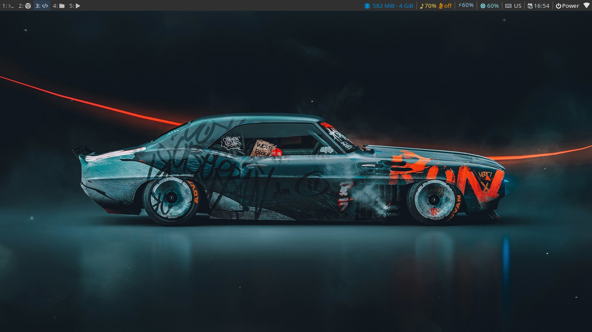

# dotfiles

My personal all stuff configurations

etc: all dotfiles in home directory

bin: executables in 	~/.local/bin

actions: custom actions for file-manager (Pcmanfm)

i3: i3wm,i3blocks configuration and custom scripts

rofi: my rofi theme

## Installation

git clone this repository cd to it and run install.sh script be careful this will overwrite your previous configs :)

## Screenshots

